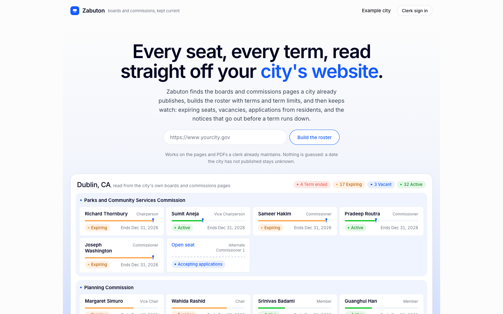
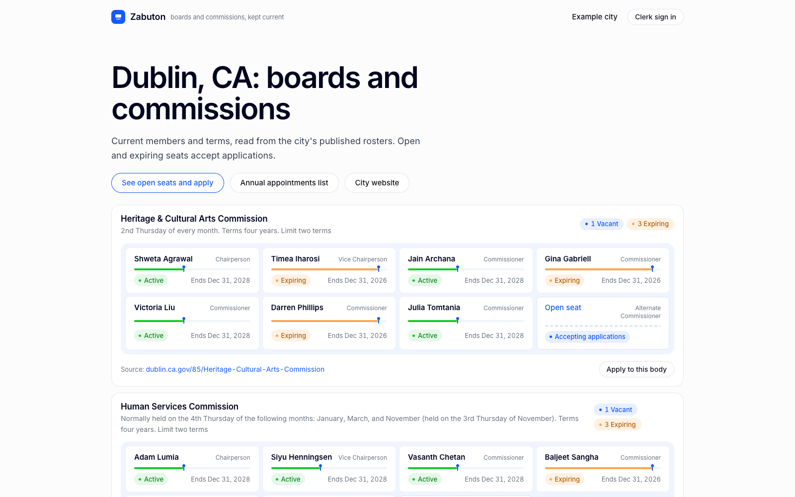
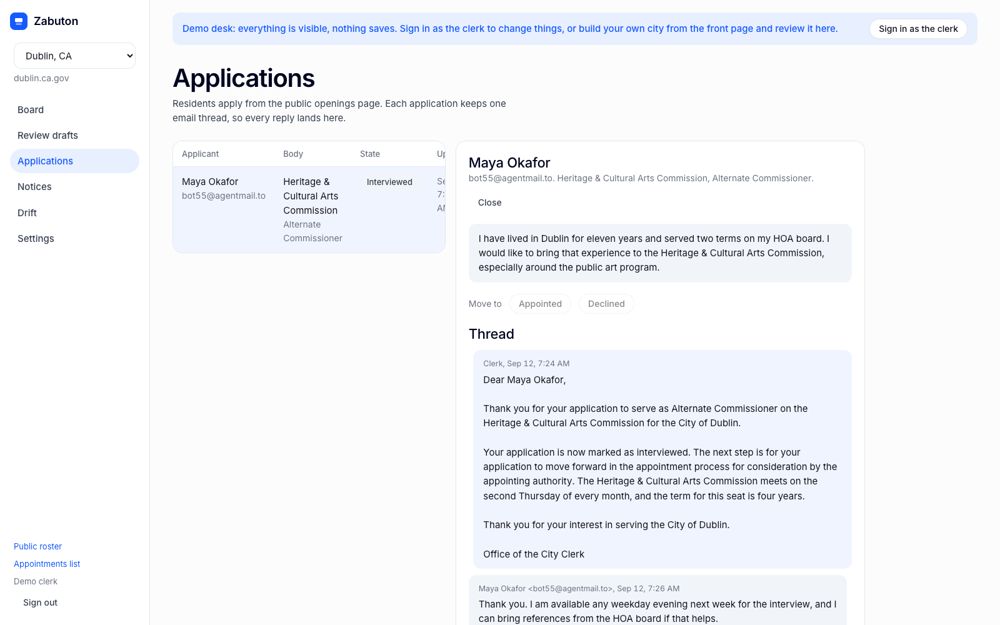

# Zabuton

Boards and commissions, kept current. Point Zabuton at a city's website and it reads every board, commission, member and term the city already publishes, then keeps that roster honest: open and expiring seats, resident applications, notices, and a daily check against the city's own pages.

Live: https://original-spoonbill-489.convex.site
Built on [Convex](https://convex.dev) with [Firecrawl](https://firecrawl.dev), [OpenAI](https://openai.com) and [AgentMail](https://agentmail.to) for the Convex All Gas Hackathon. MIT licensed.



## The problem

Every city runs dozens of volunteer boards and commissions. Each seat has a holder, an appointment date, a term end and a term limit. The clerk tracks all of it in a spreadsheet plus calendar reminders, until a term expires unnoticed or a seat sits vacant for months. In California the Maddy Act also requires a published annual appointments list. The commercial tools that sell this job onboard a city by hand, so the spreadsheet usually wins.

## How it works

Onboarding is one URL. Paste the city's website and a durable Convex workflow runs three steps, each visible on screen while it runs.

1. **Find.** Firecrawl maps the site and Zabuton ranks the boards-and-commissions pages and roster PDFs by path and title keywords. Cities that expose a Legistar API are read as JSON instead, when the site links it and it covers at least five bodies with serving members.
2. **Read.** Each candidate is fetched (with a Firecrawl scrape fallback when the city's bot wall blocks a plain fetch), then OpenAI classifies it as a roster, a vacancy notice, a rules page or neither, and extracts bodies, members, roles, appointment dates, term ends, term length and term limit. Every value carries the sentence it came from. A date the city never published stays unknown rather than guessed.
3. **Confirm.** The clerk reviews each draft next to the quoted evidence, edits in place, and confirms. Confirmed bodies appear on the public roster the same second, because the board is a live Convex query.

From there Zabuton keeps watch.

- **Seat board.** Every seat is vacant, expiring, term ended, active or not listed. A seat with no holder is a vacancy only when the city says so; a holder with no published end date is active with an unknown end, and a holder the city calls "Vacant" is a vacancy, not a person.
- **Public pages.** A roster per city, an openings page, an application form per seat or per body, and the annual appointments list as a page, a CSV and a print view.
- **Applications.** Each application keeps one AgentMail thread. OpenAI drafts the reply from the record, the clerk sends it from the city's own inbox, and the applicant's answer comes back through a webhook onto the same thread.
- **Notices.** Term-expiry and reappointment notices are drafted from the seat record and go out only after the clerk approves them. Nobody is emailed who is not on the confirmed roster.
- **Drift.** A daily cron re-reads every confirmed source page and shows both sides when the published roster and the tracked one disagree. The clerk accepts the city's version or keeps the tracked one.
- **Spreadsheet import.** When a city's pages defeat the crawl, a CSV becomes drafts for review, never confirmed bodies.





## Try it

Open the live site and paste your city's website. You are signed in anonymously and own that city, so you can review its drafts, confirm bodies and run a drift check on the clerk desk. The sample cities (Dublin, CA and the City of Ann Arbor) are read-only for demo sessions, and cities built by demo sessions are wiped after a day.

Crawls are capped at 200 per day across the deployment and 3 per city per day. Public applications are capped at 50 per city and 3 per email address per day.

## Stack

| Layer | What it does |
|---|---|
| Convex 1.45 | Live queries and mutations for the board and public pages, file storage for fetched documents, HTTP route for the AgentMail webhook, static hosting on convex.site |
| Convex Auth | Password sign-in for the clerk, anonymous sign-in for the demo desk |
| Convex workflow component | Durable bootstrap and drift chains: discover, fetch, classify, extract, diff |
| Convex crons | Daily drift check, daily wipe of demo-built cities |
| Firecrawl | Site map for discovery, scrape fallback for pages behind bot protection |
| OpenAI | Classification and grounded extraction from HTML and PDF (`gpt-5.4`, `gpt-5.4-mini`), drafted replies and notices |
| AgentMail | One inbox per city, one thread per applicant, inbound webhooks |
| React 19, Vite, TypeScript | The clerk desk and the public pages |

Tables: `cities`, `bodies`, `seats`, `members`, `terms`, `crawlRuns`, `documents`, `drafts`, `applications`, `applicationEvents`, `notices`, `threads`, `messages`, `driftFlags`, `users`.

## Run it locally

```bash
git clone https://github.com/sneg55/zabuton.git
cd zabuton
npm install
npx convex dev
npm run dev
```

`npm install` also applies `patches/@agentmail+convex+0.1.0.patch` through patch-package. The AgentMail Convex component declares its inbox and thread actions as internal and declares no environment variables, and a parent app cannot call or configure either in Convex 1.45; the patch makes those actions public and declares the env.

Set these on the Convex deployment (`npx convex env set NAME value`):

| Variable | Purpose |
|---|---|
| `FIRECRAWL_API_KEY` | Site map and scrape fallback |
| `OPENAI_API_KEY` | Classification, extraction, drafted replies |
| `AGENTMAIL_API_KEY` | City inboxes and outbound mail |
| `AGENTMAIL_WEBHOOK_SECRET` | Verifies inbound webhooks |
| `SITE_URL` | Public URL used in mail and links |
| `JWT_PRIVATE_KEY`, `JWKS` | Convex Auth keys, generated by `npx @convex-dev/auth` |

Register an AgentMail webhook pointing at `https://<deployment>.convex.site/agentmail/webhook` so replies land on the right thread. The first password account created on a deployment becomes the clerk; later accounts are applicants.

Deploy the frontend to the deployment's convex.site URL:

```bash
npm run build
npx static-hosting deploy
```

## Tests

```bash
npm test
```

206 tests on Vitest and convex-test cover extraction and provenance, term date parsing, seat states, discovery ranking, the roster diff, fetch caps and bot-wall detection, the demo-desk permission model, applications, notices and drift.

## Layout

```
convex/            backend: schema, auth, bootstrap and drift workflows, crawl, extract, drafts, roster, applications, notices, mail
convex/lib/        pure logic with unit tests: discovery, extraction, term dates, seat status, roster diff, CSV
convex/seed/       Dublin roster and rules fixtures
patches/           patch-package fix for the AgentMail component
src/               React app: landing, public city pages, apply, start (run page), clerk desk
media/demo-src/    demo video pipeline (testreel captures, cards, narration, ffmpeg assembly)
hackathon.md       build log
```

## What is live

- Dublin, CA: 7 bodies and 56 seats read from the city's own pages and PDFs, with a working city inbox and a real application thread.
- City of Ann Arbor: 29 citizen bodies and 270 seats read from the Legistar API, on the daily drift check.

## License

MIT. See `LICENSE`.
